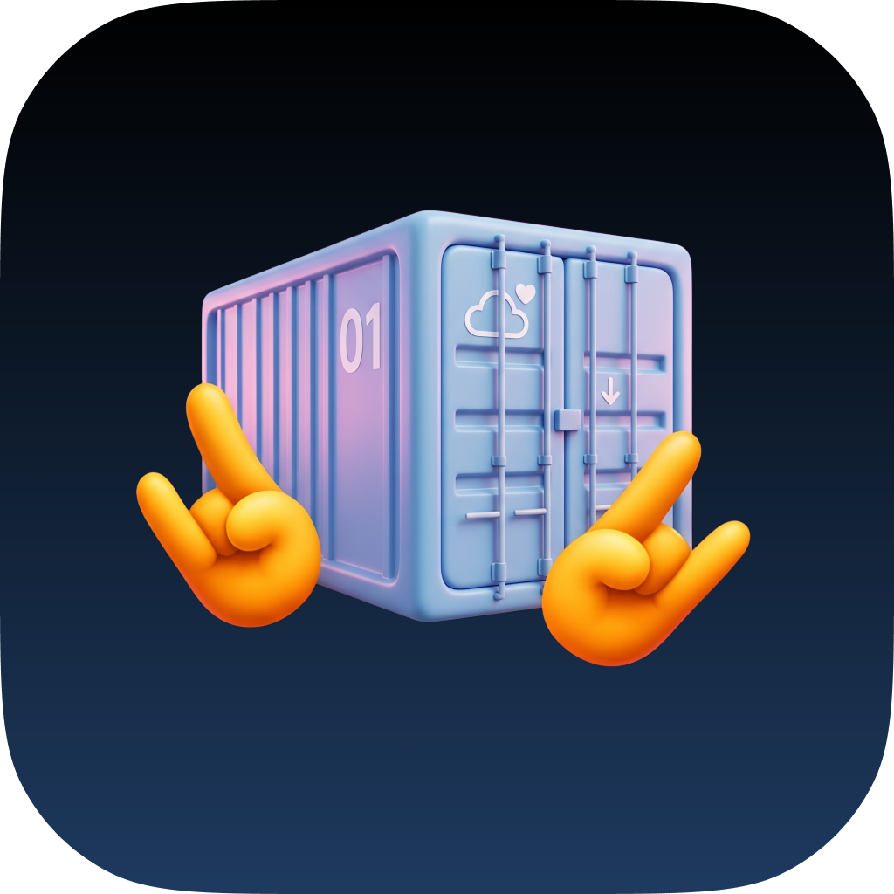

<p align="center">
  
</p>

<h1 align="center">Rocker</h1>

<p align="center">
  A native desktop client for Docker containers.<br />
  Pure Rust on <code>egui</code>/<code>eframe</code>: no webview, no bundled Chromium, no Electron.
</p>

<p align="center">
  <a href="https://github.com/makis-san/rocker/actions/workflows/ci.yml"></a>
  <a href="https://github.com/makis-san/rocker/releases/latest"></a>
  <a href="#license"></a>
  <a href="https://www.rust-lang.org/"></a>
</p>

<!-- Add a screenshot here once the UI settles:
<p align="center">
  
</p>
-->

Rocker talks straight to the Docker Engine API over a Unix socket, TLS-secured
TCP, or SSH. Nothing shells out to the `docker` CLI. The interface is
immediate-mode `egui` driven by a background async engine, so it stays responsive
while it streams logs and stats from dozens of containers at once.

---

## Status

**Alpha.** Container management works end to end. Image, volume, and network
views, the extension platform, and OS-keychain credential storage are still in
progress. The config format may change before `1.0`.

## Features

### Working today

- **Connections** over Unix socket, Windows named pipe, TLS-secured TCP, or `ssh://`
- **Container list** with live status from the Docker events stream
- **Lifecycle actions**: start, stop, restart, pause, unpause, kill, force-remove,
  plus bulk actions across a whole group
- **Streaming logs** with follow, tail depth, regex filter, and ANSI color
- **Live metrics**: CPU, memory, network, and disk I/O graphs, with a
  configurable cap on concurrent stat streams
- **Interactive shell** into a container via Docker `exec`, backed by a real VT parser
- **Container groups**: manual, or rule-based on name and label
- **Themes**: light and dark built-ins, plus custom themes loaded from TOML
- **System tray**: minimize to tray instead of quitting, with a live menu
  summary (combined CPU/memory, Docker disk usage, running/stopped counts) and
  an "open at login" toggle. Opt-in: build with `--features tray` (needs GTK 3 +
  libappindicator dev libraries on Linux). Release packages ship it enabled.

### Planned

- Image, volume, and network management
- Extension platform: `rhai` scripts and sandboxed WASM components
- Credentials stored in the OS keychain instead of an in-memory store

## Installation

### macOS / Linux

```sh
curl --proto '=https' --tlsv1.2 -LsSf \
  https://github.com/makis-san/rocker/releases/latest/download/rocker-installer.sh | sh
```

Or via Homebrew (macOS and Linux):

```sh
brew install makis-san/tap/rocker
```

### Linux: GNOME / KDE app menu

The shell installer and Homebrew both drop a bare `rocker` binary on `PATH`.
For a proper desktop-menu entry (icon, launcher, `.desktop` file), grab the
`.deb` or `.rpm` from the [latest release](https://github.com/makis-san/rocker/releases/latest)
instead:

```sh
# Debian / Ubuntu
sudo dpkg -i rocker-x86_64-unknown-linux-gnu.deb

# Fedora / openSUSE
sudo rpm -i rocker-x86_64-unknown-linux-gnu.rpm
```

(swap in the `aarch64` artifact on ARM64.) A Flatpak manifest also exists in
[`flatpak/`](flatpak/) for a future Flathub submission.

### Windows

```powershell
powershell -c "irm https://github.com/makis-san/rocker/releases/latest/download/rocker-installer.ps1 | iex"
```

A `.msi` is also attached to each release for a normal installer experience.

### Prebuilt archives

Plain `.tar.xz` (macOS/Linux) and `.zip` (Windows) archives for every target
are on the [latest release](https://github.com/makis-san/rocker/releases/latest)
page, if you'd rather place the binary yourself.

### From source

**Prerequisites**

- [Rust](https://rustup.rs/) 1.90 or newer
- A running Docker daemon (rootless Docker recommended)
- Linux only: `libxkbcommon-dev`, `libwayland-dev`, `libgtk-3-dev`
  (package names vary by distro)

```sh
git clone https://github.com/makis-san/rocker.git
cd rocker
cargo run -p rocker          # run in place
cargo build --release -p rocker   # or build a binary at target/release/rocker
```

## Usage

On first launch Rocker connects to the local daemon: `/var/run/docker.sock`, or
`//./pipe/docker_engine` on Windows. Add and switch hosts from **Settings**.

Configuration and data live in the platform's standard directories:

| Platform | Config file | Data (history, etc.) |
| -------- | ----------- | -------------------- |
| Linux    | `~/.config/rocker/config.toml` | `~/.local/share/rocker/` |
| macOS    | `~/Library/Application Support/rocker/config.toml` | `~/Library/Application Support/rocker/` |
| Windows  | `%APPDATA%\rocker\config.toml` | `%LOCALAPPDATA%\rocker\` |

Custom themes are read from a `themes/` folder next to the config file.

## Development

```sh
cargo run -p rocker          # launch the app
cargo test --workspace       # run all tests
cargo clippy --workspace     # lint
cargo fmt --all --check      # check formatting
cargo xtask budgets          # check performance budgets
```

See [`RELEASING.md`](RELEASING.md) for how tagged releases build and publish
the installers above.

### Workspace

| Crate             | Role                                                        |
| ----------------- | ---------------------------------------------------------- |
| `rocker-core`     | Domain models and pure logic. No I/O, no UI.               |
| `rocker-engine`   | `bollard` client, command/event protocol, background task. |
| `rocker-store`    | TOML config plus `redb` history.                           |
| `rocker-secrets`  | OS keychain seam.                                           |
| `rocker-term`     | VT parser plus Docker-exec backend.                        |
| `rocker-theme`    | Design-token schema plus theme loading.                    |
| `rocker-ext-api`  | Extension contract: capabilities, manifest, declarative UI.|
| `rocker-ext-host` | Supervised extension host plus capability gate.            |
| `rocker-ui`       | `egui` widgets and the `eframe::App`.                      |
| `rocker`          | Binary: runtime, logging, CLI wiring.                      |
| `xtask`           | Build, package, and release automation plus budget checks. |

`rocker-core`, `rocker-engine`, and `rocker-store` form the UI-agnostic core,
reusable by a future menubar or TUI front-end.

### Architecture

```
+-----------------------------------------------------------+
|  rocker-ui  (egui / eframe)                               |
|  container list | logs | terminal | plots | ext panels    |
+---------------------------+-------------------------------+
                            |  Command mpsc  /  Event mpsc
+---------------------------v-------------------------------+
|  Core crates  (Rust, UI-agnostic)                        |
|  connection manager | Docker service | event bus          |
|  group store | credential manager | stats collector       |
|  extension host | theme registry | persistence            |
+---------------------------------------------------------+
```

The UI thread posts `Command`s and never `.await`s; the async engine posts
`Event`s back, which the UI drains once per frame.

## Contributing

Contributions are welcome. See [CONTRIBUTING.md](CONTRIBUTING.md) for the
workflow, commit conventions, and code style.

## Security

Please report security issues privately through
[GitHub Security Advisories](https://github.com/makis-san/rocker/security/advisories/new).
Do not open a public issue for vulnerabilities.

## License

Licensed under either of

- [MIT License](LICENSE-MIT)
- [Apache License, Version 2.0](LICENSE-APACHE)

at your option. Unless you state otherwise, any contribution you submit for
inclusion in Rocker is dual-licensed as above, with no additional terms.
